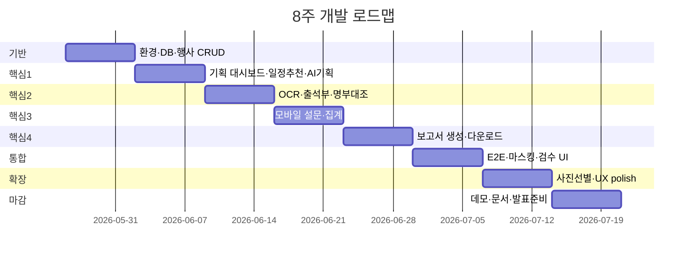

# 대학 사업 운영 AI 에이전트 — 개발 계획 (8주 · 1인 · 과제 프로토타입)

> 기준 문서: `Vibe Coding 프로젝트 설계_양하영.md`  
> 목표: **핵심 업무 흐름이 끝까지 이어지는 데모** (실무 운영·보안 인증 수준은 범위 외)

---

## 1. 목표 재정의

| 항목 | 과제용 목표 | 의도적으로 제외 |
|------|-------------|-----------------|
| 성공 기준 | 행사 1건을 시스템에 등록 → 기획 초안 → (선택) OCR/설문/사진 → 보고서 초안 PDF/DOCX 다운로드 | 대학 SSO, NAS/SharePoint 실연동, 전자결재 연동 |
| 사용자 | 발표/시연 시 담당자 역할 1명 + 참여자 역할 1명 | 다부서·다권한 RBAC |
| 데이터 | 샘플 학사일정·명부·과거 행사 CSV + API | 실제 재학생 DB 직접 연동 |
| AI | Claude API + OCR API (마스킹 파이프라인 포함) | 얼굴 DB 저장·신원 식별 |

---

## 2. 권장 기술 스택 (1인·8주 기준)

| 영역 | 선택 | 이유 |
|------|------|------|
| 프론트 | **Next.js (App Router) + TypeScript** | 웹 1벌로 담당자 UI + 모바일 설문 URL 공유 |
| UI | Tailwind + shadcn/ui | 빠른 대시보드·폼·테이블 |
| 백엔드 | Next.js Route Handlers + Server Actions | 별도 서버 없이 1인 유지보수 용이 |
| DB | **SQLite (Prisma)** 또는 Supabase Free | 로컬·배포 모두 단순 |
| 파일 | 로컬 `uploads/` 또는 Supabase Storage | 사진·서명지 |
| OCR | **Clova OCR** (한글) 우선, 실패 시 Vision API | 설계서 명시 |
| LLM | **Claude API** | 기획 초안·보고서 문장·설문 키워드 |
| 보고서 | **DOCX** (`docx` npm) + **PDF** (html-pdf 또는 puppeteer) | HWP는 8주 1인에게 리스크 큼 → DOCX/PDF로 시연 |
| 배포 | Vercel (선택) | 데모 URL 공유 |

---

## 3. MVP 범위 (8주 안에 반드시)

설계서 5단계 중 **데모 스토리**에 맞게 축소합니다.

### Must Have (Week 1~6)

1. **행사 기획 대시보드** (선택하신 1순위)
   - 행사 CRUD, 달력 뷰
   - 샘플 학사일정·공휴일 CSV 업로드/내장
   - 날짜 추천(시험 2주·공휴일 제외 규칙)
   - KPI·예산 입력 + 단가 규칙 경고(하드코딩 규칙표)
   - Claude로 기획안 초안 생성 + 저장

2. **참여자·출석 (경량 OCR)**
   - 서명지 이미지 업로드 → OCR → 이름·학번 테이블
   - 신뢰도 &lt; 90% → `검토 필요` 플래그 (자동 확정 금지)
   - 샘플 명부 CSV 대조 → 녹색/빨간색 표시
   - **외부 API 전송 전 마스킹** 미들웨어

3. **모바일 설문 (웹)**
   - 행사별 고유 URL
   - 리커트 1~5 + 주관식(500자)
   - 실시간 평균·응답 수 대시보드
   - 주관식 → Claude 키워드 요약 (워드클라우드는 Week 7 여유 시)

4. **결과 보고서 초안**
   - 출석·설문·예산·행사 메타 통합
   - 지표 자동 계산(참여율 등) + Claude 성과 문단
   - DOCX/PDF 다운로드 + 화면 미리보기

### Should Have (Week 7~8, 시간 되면)

5. 사진 일괄 업로드 + **휴리스틱 선별**(초점·해상도·얼굴 유무는 OpenCV/메타데이터 수준, 표정 AI는 제외)
6. 미응답 설문 리마인드(이메일 mock 또는 화면 알림만)
7. 오프라인 촬영 → 온라인 시 업로드( Service Worker 또는 “나중에 업로드” 큐 UI )

### Won’t Have (과제 범위 밖 명시)

- 네이티브 모바일 앱 (앱스토어)
- HWP 원본 생성·결재 시스템 연동
- 실제 학사/명부 DB 실시간 연동
- 카카오 알림톡·SMS 발송
- 얼굴 인식 DB·표정 기반 만족도

---

## 4. 8주 일정 (주차별)



| 주차 | 목표 | 산출물 |
|------|------|--------|
| **1** | 프로젝트 셋업, 도메인 모델 | Next.js, Prisma, `Event`/`Participant` 스키마, 행사 목록·상세 |
| **2** | 기획 대시보드 | 달력, 일정 CSV, 날짜 추천 API, 예산 경고, Claude 기획 초안 |
| **3** | OCR 파이프라인 | 업로드 UI, Clova 연동, 검토 필요 플로우, 명부 대조 |
| **4** | 설문 | 공개 설문 페이지, 응답 저장, 담당자 집계 화면 |
| **5** | 보고서 | 지표 계산, Claude 본문, DOCX/PDF export |
| **6** | 통합·데모 데이터 | 시나리오 1건 end-to-end, 마스킹·금기 로직 테스트 |
| **7** | 부가 기능·UI | 사진 선별(선택), 반응형·에러 메시지 정리 |
| **8** | 버퍼 | 버그 수정, README, 5분 시연 스크립트, 스크린샷/GIF |

---

## 5. 화면별 구현 체크리스트 (설계서 6.2 매핑)

| # | 화면 | Week | 핵심 구현 |
|---|------|------|-----------|
| 1 | 행사 기획 대시보드 | 2 | FullCalendar, 추천일 API, KPI/예산 폼, AI 초안 패널 |
| 2 | 서명지 업로드 | 3 | `<input capture>` 모바일 촬영, OCR 진행률 |
| 3 | 참여자명단 확인 | 3 | DataTable, 상태 색상, 인라인 수정 |
| 4 | 모바일 설문 | 4 | `/survey/[token]`, 슬라이더, 제출 완료 |
| 5 | 사진 갤러리 | 7 | 드래그 업로드, 상위 N장 그리드 |
| 6 | 보고서 초안 | 5 | 요약 카드, 생성 버튼, 미리보기·다운로드 |

---

## 6. 데이터 모델 (초안)

```
Event
  id, title, type(봉사/다문화/지역), date, budget, kpiTarget
  planDraft (JSON/text), status

AcademicCalendar  // CSV import
  date, label(exam|holiday|normal)

StudentRoster     // CSV import
  studentId, name, department

AttendanceRecord
  eventId, name, studentId, type(재학생|지역주민)
  ocrConfidence, reviewStatus(pending|ok|flagged)
  sourceImagePath

SurveyResponse
  eventId, likert1..n, openText, submittedAt

Photo
  eventId, path, score, selectedForReport

Report
  eventId, metrics(JSON), bodyMarkdown, docxPath
```

---

## 7. AI·보안 구현 원칙 (설계서 Ⅴ 반영)

1. **마스킹 레이어** (`lib/privacy.ts`): API 호출 직전 이름·학번 변환
2. **OCR**: confidence &lt; 0.9 → DB `flagged`, UI에서만 수정 가능
3. **보고서**: 생성물에 “초안·검수 필요” 워터마크 또는 고정 문구
4. **예산**: 규칙 JSON 초과 시 `warning` (통과 처리 금지)
5. **로그**: 원문 PII는 서버 로그에 남기지 않음

---

## 8. 시연 시나리오 (5분)

1. 새 행사 “2026 봉사의 날” 생성
2. AI가 추천한 날짜 선택 → 기획 초안 생성·저장
3. 서명지 사진 업로드 → 2명 `검토 필요` 수정
4. 설문 URL QR(또는 링크) → 3건 응답 시뮬레이션
5. 보고서 생성 → PDF 다운로드 → “참여율 32% (14/44)” 수치 확인

---

## 9. 리스크와 대응

| 리스크 | 대응 |
|--------|------|
| OCR 정확도 낮음 | 데모용 고해상도 샘플 이미지 3장 준비, 수동 수정 UI 강조 |
| API 비용 | Claude 호출 토큰 제한, 캐시, 데모 모드(짧은 프롬프트) |
| HWP 요구 | DOCX로 생성 후 “한글에서 열기” 안내 슬라이드 1장 |
| 1인 일정 지연 | Week 7 사진·리마인드는 과감히 Cut, Week 8 버퍼 |
| 개인정보 | 전 과정 마스킹 데모 + 코드 주석으로 과제 평가 포인트 |

---

## 10. 아직 확인이 필요한 사항

아래에 답해 주시면 Week 2~3 상세 태스크를 더 구체화할 수 있습니다.

1. **MVP ‘기타’**로 적으신 우선 기능이 있나요? (기획 외에 OCR·설문·보고서 중 2순위)
2. **행사 유형**을 처음부터 3종(봉사/다문화/지역) 모두 지원할지, **1종만** 깊게 할지?
3. **HWP**가 과제 rubric에서 필수인지, DOCX/PDF면 충분한지?
4. **발표/제출 마감일**이 8주 중 어느 주인지? (예: 6월 말)
5. **Claude 외** 학교에서 허용하는 LLM이 정해져 있는지?

---

## 11. 다음 액션 (지금 바로)

- [ ] 위 10번 질문 답변
- [ ] Week 1: `npx create-next-app` + Prisma + 기본 `Event` CRUD
- [ ] 샘플 데이터 준비: `data/academic_calendar.csv`, `data/roster_sample.csv`, 서명지 이미지 2~3장
- [ ] API 키: `.env.local` (Claude, Clova) — git 제외

답변 주시면 **Week 1~2 태스크를 이슈 단위로 쪼갠 실행 목록**까지 이어서 작성하겠습니다.
